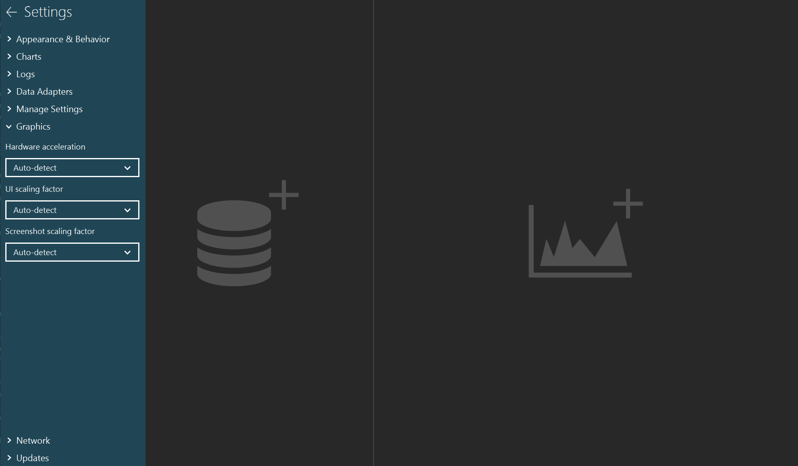
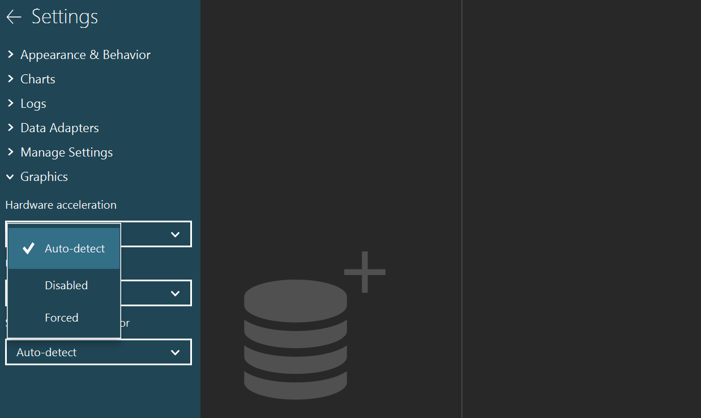
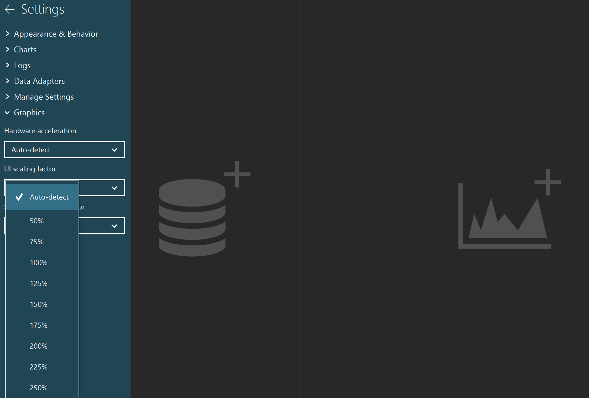

# New graphics settings are coming to binjr

I'm considering adding a new sub-category to binjr's `Settings` panel, which, for the time being, goes by the woefully unimaginative name of "Graphics".  

Not that I am planning to turn binjr into a video game engine or anything, but because I've recently felt the need to surface some existing JavaFX properties pertaining to how its rendering stack operates directly into the application. Up until now those were only settable via undocumented command line arguments, and having a more accessible way to control them seemed like a good idea.

<!-- more -->

## Hardware acceleration support

binjr, courtesy of JavaFX, has always been capable of using hardware accelerated rendering on all supported platforms; via OpenGL on Linux and macOS (JavaFX Metal support is currently under development) and Direct3D on Windows. The framework automatically chooses the most appropriate rendering pipeline, falling back to a software-only implementation in the event that a suitable HW back-end could not be found.  

It generally does a good job at that on pretty much all OS, but there are some cases were it can be useful to override its decision, in one way or the other: for instance you might want to try and force using the HW back-end even when the heuristics weighted against that, like when running inside a virtual machine or on some more exotic hardware.

Conversely, you might want to forcibly **disable** HW acceleration, if you experience rendering glitches or if the application is unstable.

## Overriding the User Interface scaling factor

JavaFX has really great support for HiDPI screens built-in, as it is able to produce a crisp output even when scaling a user interface by a fractional factor, like 125% or 150%. It can even use different horizontal and vertical scaling factors, i.e. scale an application's width to 125% and its height's  to 150%, without the result being a blurry mess!

And because this scaling doesn't rely on the underlying operating system's graphical interface, it works even on platforms that don't support support this natively.

But since JavaFX's scaling is entirely independent from the environment it runs on, this means the framework has to be able to retrieve the underlying platform-wide scaling factor and apply it internally by default in order to make users' life simple. It usually does a good job at this, but it can sometime be a bit problematic.

Fist of all, there are some cases where detecting the scale factor automatically just doesn't work well: on Windows or macOS, this is generally not an issue, but on Linux is can be tricky. For instance, JavaFX will attempt to retrieve that info from configuration files typically used by GNOME, which can leaves users of other desktop environments out of luck.  
And while it's always possible for savvy users to add the right bits of configuration to their desktop to workaround the issue (i.e. set `org.gnome.desktop.interface scaling-factor` or export `GDK_SCALE`), the results can sometimes be unsatisfactory, for example forcing GNOME's lack of support for fractional scale factors onto KDE, which does support those.

And of course, regardless of the environment, there can always be cases where a user might want to use a different scale for their binjr window than for the rest of their desktop.

For these reasons, the next release of binjr will propose a new set of settings where users can decide to override the default scale factor automatically detected by the framework, be it because that default value was wrong, or because they'd just like something different, for a change.

Right now, I've opted to propose a closed list of settings, ranging from 50 to 350 percents, by 25% intervals. We also only propose square ratios (i.e. identical horizontal and vertical values).  
This feels like a good compromise in exposing _some_ of the possibilities enabled by JavaFX while keeping the list of available choice reasonably short.  

With that said, this is still a work-in-progress, so feel free to chime in if you'd like to propose something else.

Please note that this option is unfortunately **not available** on macOS, since apparently JavaFX lacks a way to override the detect scaling factor on this platform. Although, as mentioned earlier, the automatic detection is usually flawless on macOS, it is this still a bit disappointing, as scaling an app's window independently from the rest of the desktop could always prove useful (unless the OS itself already has this built-in? I must admit I don't know much about Macs).

## Screenshot scaling factor

A similar option, that applies to images generated by the screen capture feature in binjr, has been available for a long time; moving it to this menu (it used to sit under `Appearance & Behavior`), and aligning the options it proposes onto those offered for the UI scaling factor seemed like the sensible thing to do.

## Give it a try and tell us what you think!

All this is planned for the upcoming 3.17 release, but you can try it already by using the preview build [available here](https://github.com/binjr/binjr/releases/tag/v3.17.0-SNAPSHOT).
