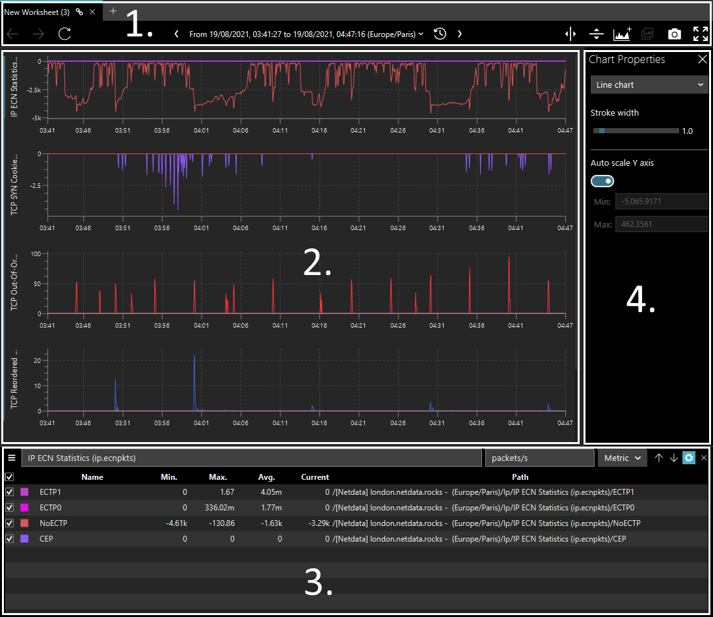
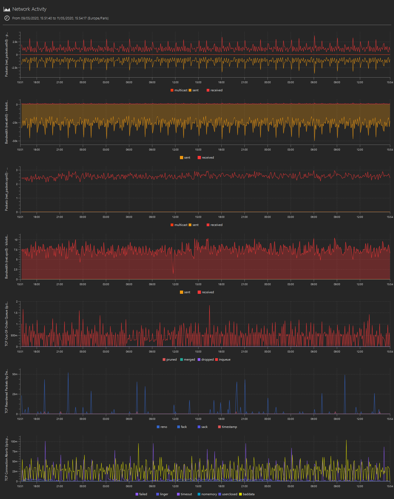

# Charts worksheets

A chart worksheet is composed of the following areas:

1. A navigation bar, to manipulate the worksheet's time range.
2. One or more charts where the time-series data are plotted.
3. A table view listing the various series that were added to the worksheet.
4. A property pane that shows the properties of currently selected chart. 

## Adding a chart worksheet

To add a chart worksheet to the current workspace, use the menu bar to
navigate to Worksheet and select New Worksheet (or press `Ctrl+W`):

!!! Example "Example"
    <video controls  muted src="/assets/videos/add_worksheet_menu.mp4" type="video/mp4"/></video>

Similarly to sources, clicking on the background chart icon on an empty
pane will also add a new worksheet.

!!! Example "Example"
    <video controls  muted src="/assets/videos/add_worksheet_icon.mp4" type="video/mp4"/></video>

## Adding time series

In order to view and navigate the time series exposed by a connected source, you need to add it to a chart on a 
worksheet first.

### To an existing chart

Drag the selected series onto the chart area in order to plot their data for the current time range of the worksheet

!!! Example "Example"
    <video controls  muted src="/assets/videos/drop_series_existing_chart.mp4" type="video/mp4"/></video>

### To a new chart

If you drop series from the tree onto the *hilited area below the other charts*, a new chart will be added the
worksheet.

!!! Example "Example"
    <video controls  muted src="/assets/videos/drop_series_new_chart.mp4" type="video/mp4"/></video>
    
Charts created this way will automatically have theirs name, unit and chart type set according to the corresponding 
values in the source (if the source type provides that information).

Furthermore, if you drop more than one "sub-tree" (nodes with leaves) onto this area, an equal amount of new charts will
 be created, each populated with its own leaves 

!!! Example "Example"
    <video controls  muted src="/assets/videos/drop_series_multiple_charts.mp4" type="video/mp4"/></video>

If you want to plot leaves from different hierarchical nodes onto the same chart, then you'll have to first create the 
chart and explicitly drop the selected series onto its area.

!!! Tip
    All the actions described above can also be accomplished via a context menu instead of drag & drop; simply 
    right-clik onto the selected
    series on the tree view and choose the action from the menu.

    <video controls  muted src="/assets/videos/menu_series_existing_chart.mp4" type="video/mp4"/></video>

### To a new worksheet

If you drop series from the tree onto the *hilited area above the worksheet*, a new tab is created and series are 
added to it.

!!! Example "Example"
    <video controls  muted src="/assets/videos/drop_series_new_worksheet.mp4" type="video/mp4"/></video>
    
!!! Tip
    If you drop a set of series directly onto the center icon on an empty worksheet pane, binjr will create a new 
    one and add the new charts.

    <video controls  muted src="/assets/videos/drop_series_empty_worksheet.mp4" type="video/mp4"/></video>
    

## Editing the view

Once you've populated a worksheet with series you're interested in, you can edit and change many of its aspects to 
tailor the view to your own needs and preferences. 

### Changing the layout

By default, multiple charts on a single worksheet are displayed one above the other, with their timeline (X axis) 
aligned perfectly.  
You can change that default "stacked" layout to an "overlay" layout using the icon to the far right of the navigation bar.  
 
!!! Example "Example"
    <video controls  muted src="/assets/videos/worksheet_change_layout.mp4" type="video/mp4"/></video>
    
!!! Info "Note"
    When viewed with an overlay layout, all series are plotted on the same chart (sharing a single X axis) but with 
    individual Y axis. This is useful when you want to correlate visually two or more series that do not share the same 
    unit and scale on the Y axis.

### Editing a chart's title and unit

You can change the title, unit name and prefix in the table list below the charts when the `Chart Properties` panel 
is available. To bring up the panel if it isn't visible, click on the `cog` icon next to a chart's entry in the table 
or at the top of its Y axis.

!!! Example "Example"
    <video controls  muted src="/assets/videos/worksheet_edit_chart_metadata.mp4" type="video/mp4"/></video>
    
!!! Info "Note"
    Changing a chart's unit prefix affects the way the scale of the Y axis 
    automatically adapts its label:
    
    - `Metric`: Y axis graduations are divided by factors of 1000 and use metric prefixes (Kilo, Mega, Giga, etc…).
    - `Binary`: Y axis graduations are divided by factors of 1024 and use binary prefixes (Kibi, Mebi, Gibi, etc…).

### Changing a chart's aspect

!!! Tip
    Select the current chart by clicking on its title in the table list or on its Y axis.

You can change the visual representation of the current chart from the `Chart Properties`: pick-up a chart type in the 
drop down menu and adjust the lines weight and area's opacity where applicable.  

!!! Example "Example"
    <video controls  muted src="/assets/videos/worksheet_change_chart_type.mp4" type="video/mp4"/></video>

!!! Warning "Note"
    Changing the chart's type affect *all* series in the chart: it is not possible to have some series plotted as areas
    and other as lines in a single chart.  
    An approaching result can however be achieved [using the "overlay" layout](#changing-the-layout).

### Changing series color

Click on the colored square next to a series' legend in the bottom table to invoke a color picker and choose a new color
for it.

!!! Example "Example"
    <video controls  muted src="/assets/videos/worksheet_change_series_color.mp4" type="video/mp4"/></video>

### Changing series order

To change the order in which a series are plotted onto the chart, drag it from the table view and drop it to the 
desired position.
 
!!! Example "Example"
    <video controls  muted src="/assets/videos/worksheet_change_series_order.mp4" type="video/mp4"/></video>
    
!!! Info "Note"
    Series order is important in area charts and stacked area charts as it affects the aspect of the graph.

!!! Warning "Note"
    You cannot drag series from one chart and drop it onto a *different* chart.

### Removing series from a chart

To remove series from a chart, simply select the desired series and press the `Delete` key.

!!! Example "Example"
    <video controls  muted src="/assets/videos/worksheet_remove_series.mp4" type="video/mp4"/></video>
    
!!! Tip
    You can also hide series from a chart without removing them by unchecking the box next to their title in the bottom
    table. 

## Navigation

### Scaling the Y axis

By default, the Y axis for all charts is set to automatically adapt to the minimum and maximum values in the current
 time range.

You can however override this behaviour and fix both minimum and maximum display boundaries for the Y axis, by unchecking
the `Auto Scale Y Axis` option in the `Chart Properies` panel and set the desired values in the fields beneath it. 

!!! Example "Example"
    <video controls  muted src="/assets/videos/worksheet_scale_y_axis.mp4" type="video/mp4"/></video>

### Zooming

Toggle the horizontal or vertical crosshair axis using the icons on the left of the navigation bar, and zoom in by 
clicking on a chart and dragging the selection zone over the area you wish to zoom. 

!!! Tip
    You can also quickly toggle the horizontally and vertically crosshair marker by holding respectively the `Ctrl` and 
    `Shift` keys.
    
!!! Example "Example"
    <video controls  muted src="/assets/videos/worksheet_chart_zoom.mp4" type="video/mp4"/></video>
    
!!! Info "Note"
    In the `stacked` layout, zooming on the horizontal axis (i.e. the time line) applies to all charts one the worksheet, 
    while vertical zoom only applies to the selected chart.  
    
    Int the `overlay` layout, zooming on both axis applies to all charts.          

    
## Taking snapshots

Press the "camera" icon on the navigation bar to capture the current worksheet as a static  picture.

The resulting image, saved as a `.png` file, will always be captured as if in "Presentation mode" (i.e. without source 
pane, chart properties and condensed chart legends), and contain the entirety of the worksheet's chart area even if 
scrolling is required to view it within the application.

The worksheet's name and time range is also printed at the top of the snapshot. 

!!! Example "Example"
     