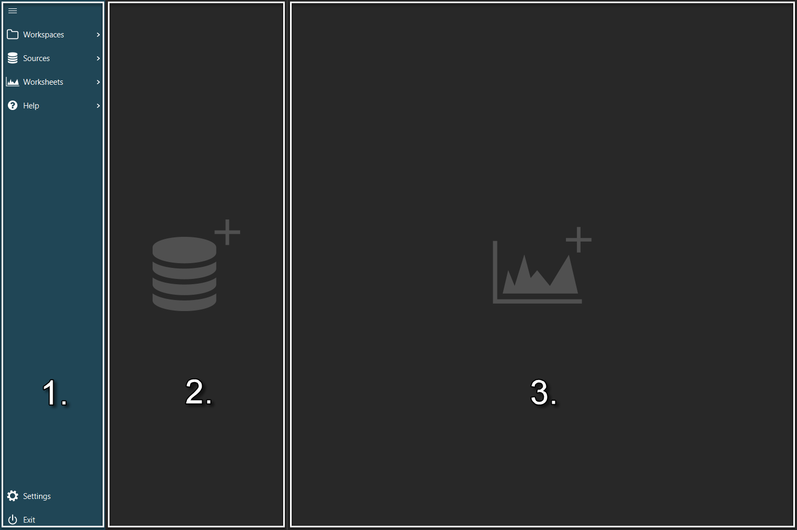

# Landing screen

The landing screen for binjr is composed of three main parts; from left to right:

## 1. The menu bar

This menu hosts entries for all the main user interactions; managing workspaces, sources and worksheets, getting 
assistance, modifying user preferences and exiting the application.

!!! Tip
    You can expand the menu bar by clicking on the "hamburger" icon. This will reveal labels for the available options 
    proposed in the menu.
    
## 2. The source pane

This is the area where currently available time-series sources are shown.

(see [Source pane](sources.md) for more details)

## 3. The worksheet pane

This is the area where data visualization and navigation takes place.

(see [Worksheet pane](worksheets.md) for more details)
